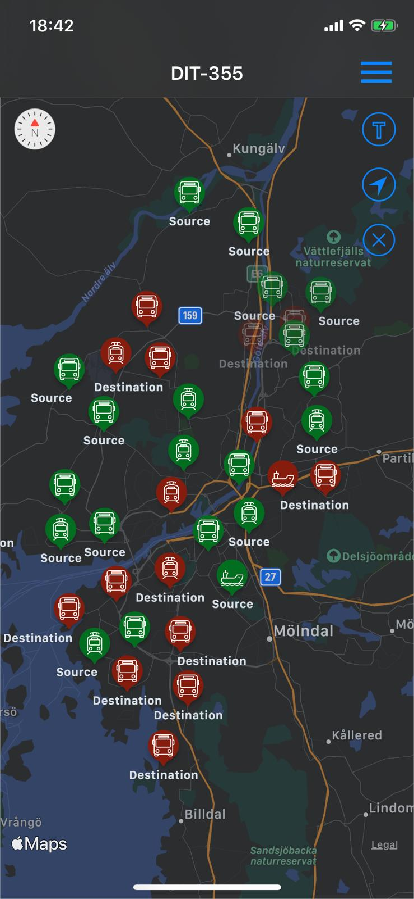
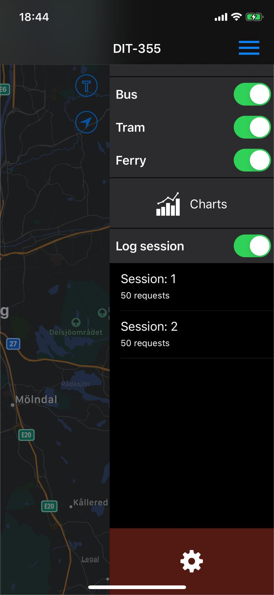
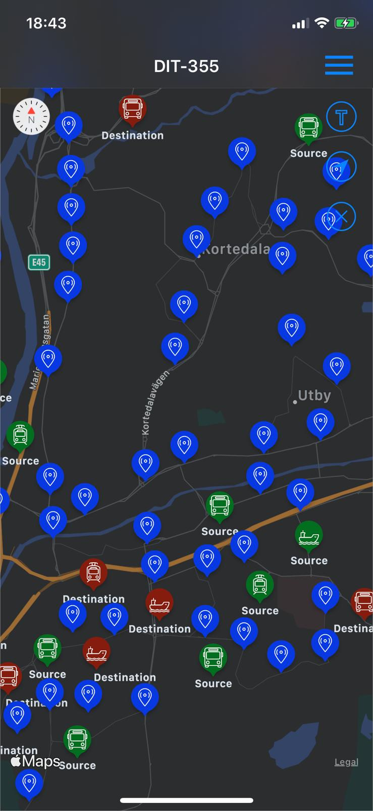
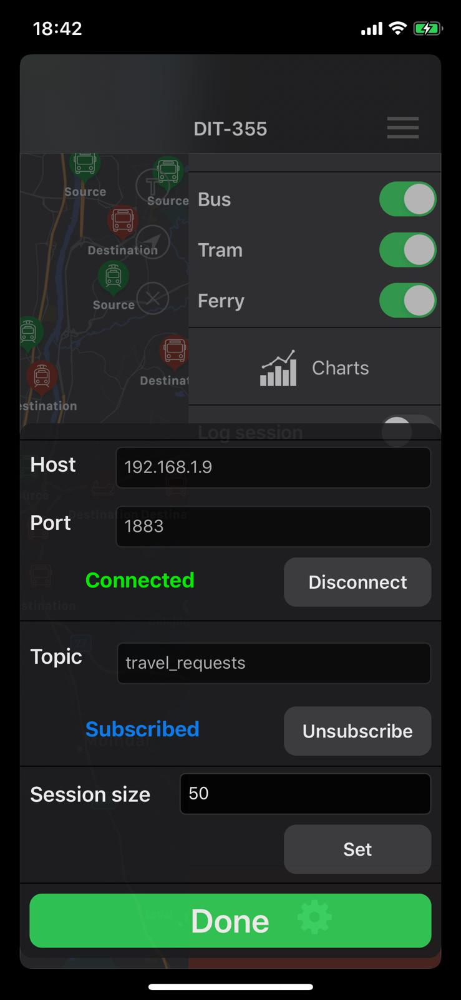
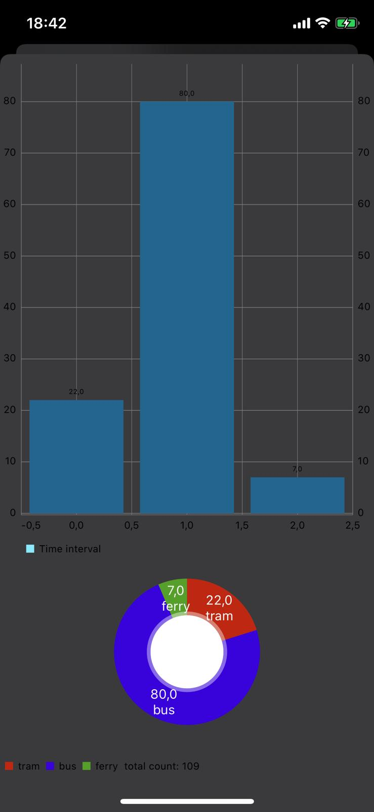
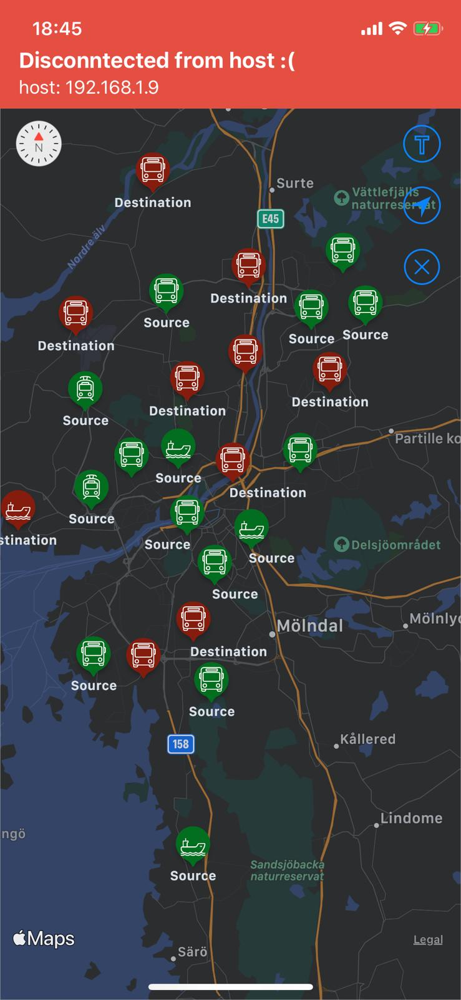
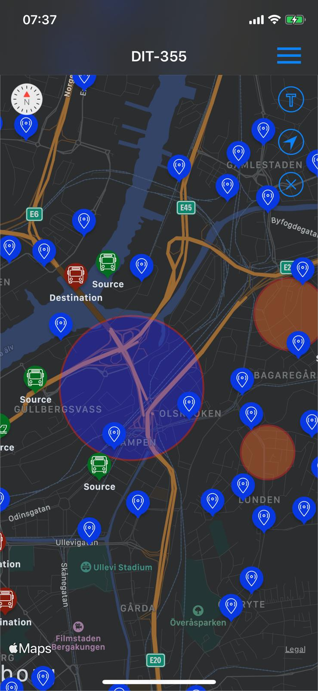

# DIT355 visualizer app - iOS Client

## Introduction
The visualiser of group 9 is an iOS client with the responsibility of visualising public transport requests in the greater Gothenburg area.

## Technologies
The app is developed for iOS 13, written in Swift 5 using Xcode 11 where Cocoapods is the main package manager.

### Cocoapods packages: 
* CocoaMQTT: 1.3
* SwiftyJSON: 4
* NotificationBannerSwift: 3.0
* Charts: 3.4

## Setup
Clone this repo and navigate to the project directory then run `pod install` to install all the dependencies.
If you don't have Cocoapods installed follow [this tutorial](https://guides.cocoapods.org/using/getting-started.html)

## Features
* Configurable MQTT connection
* Visualise the data on a map
* Log the data into sessions
* Filter the data
* Create charts to summarise the data 

### Screenshots

## Authors and Acknowledgment
This module is part of the distributed system for Visual Transportation Support developed by Clusterrot (Group 9) during the course DIT355 Miniproject: Distributed Systems at the University of Gothenburg.
The system was implemented from November 2019 through January 2020.
Clusterrot consists of the following members:

* Tobias Bank
* Armin Ghoroghi
* Simon Johansson
* Kardo Marof
* Jean Paul Massoud
* Konrad Otto
